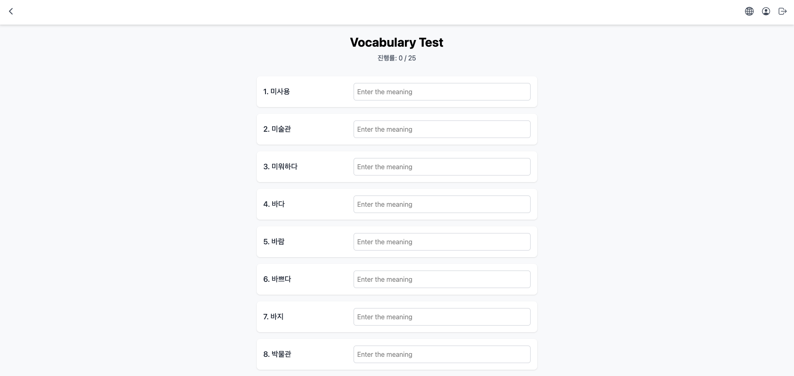

# 🇰🇷 SayKO (세이코) - 한국어 단어 학습 애플리케이션


SayKO는 한국어 학습자들이 매일 새로운 단어 카드를 통해 재미있게 어휘를 학습할 수 있도록 돕는 웹 애플리케이션입니다. 이미지와 예문을 통해 단어를 효과적으로 암기하고, 퀴즈를 통해 학습 성과를 확인할 수 있습니다.

---

### 📅 개발 기간
- **기간:** 2025년 6월 (1인 개발)

---

### 🛠️ 사용 기술 스택

| 구분 | 기술 |
|------|---------------------------------------------------------|
| 🌐 **Frontend** | `React`, `TypeScript`, `Vite`, `Tailwind CSS` |
| ☁️ **Backend & DB** | `Firebase (Firestore, Storage, Authentication)` |
| 📜 **Scripts** | `Node.js`, `Firebase Admin SDK`, `Sharp` (이미지 처리) |

---

### 🖥️ 실제 사용 화면

SayKO의 주요 기능들을 소개합니다.

#### 1. 메인 페이지 및 로그인
*Google 계정으로 간편하게 로그인하고 학습 현황을 확인하세요.*
| 로그인 전 | 로그인 후 대시보드 |
| :---: | :---: |
|  |  |

#### 2. 체계적인 단어 학습
*매일 제공되는 25개의 단어를 목록과 플래시카드로 학습합니다.*
| 오늘의 단어 | 플래시카드 학습 |
| :---: | :---: |
|  |  |

#### 3. 퀴즈 및 학습 관리
*퀴즈로 실력을 점검하고, 마이페이지에서 학습 기록을 관리하세요.*
| 단어 퀴즈 | 마이페이지 |
| :---: | :---: |
|  |  |

#### 단어 상세 정보
*이미지와 예문을 통해 단어를 깊이 있게 이해할 수 있습니다.*
<p align="center">
  
</p>

---

### 📂 프로젝트 구조

```
SayKO/
├── 📁 public/              # 정적 에셋 (폰트, 아이콘 등)
├── 📁 scripts/             # DB 초기화, 이미지 처리 등 자동화 스크립트
│   ├── generateImages.mjs
│   ├── optimizeAndUploadImages.mjs
│   └── ...
├── 📁 src/                  # 프론트엔드 소스 코드
│   ├── 📁 assets/           # 이미지 등 리소스 파일
│   ├── 📁 components/       # 재사용 가능한 UI 컴포넌트 (WordCard, Modal 등)
│   ├── 📁 contexts/         # 전역 상태 관리 (AuthContext)
│   ├── 📁 hooks/            # 커스텀 훅
│   ├── 📁 pages/            # 라우팅 단위 페이지 컴포넌트 (HomePage, LoginPage 등)
│   ├── 📁 services/         # Firebase 통신 관련 서비스 로직
│   ├── 📁 types/            # TypeScript 타입 정의
│   ├── App.tsx             # 메인 애플리케이션 컴포넌트
│   ├── firebase.ts         # Firebase 클라이언트 초기화
│   └── main.tsx            # 애플리케이션 진입점
├── .firebaserc             # Firebase CLI 설정
├── firebase.json           # Firebase 호스팅/규칙 등 설정
├── package.json            # 프로젝트 의존성 및 스크립트
└── README.md               # 프로젝트 소개
```

---

### 🚀 시작하기

1.  **저장소 복제:**
    ```bash
    git clone https://github.com/your-username/SayKO.git
    cd SayKO
    ```

2.  **Firebase API 설정:**
    이 프로젝트는 Firebase를 사용하므로, 실행을 위해 API 키 설정이 필요합니다.

    **A. 클라이언트 앱 설정 (.env.local)**
    - Firebase Console에서 프로젝트의 웹 앱 설정을 찾습니다.
    - 프로젝트 루트 폴더에 `.env.local` 파일을 생성하고, 아래 내용을 자신의 Firebase 키로 교체하여 붙여넣습니다.

    ```dotenv
    # .env.local 파일

    VITE_FIREBASE_API_KEY="YOUR_API_KEY"
    VITE_FIREBASE_AUTH_DOMAIN="YOUR_AUTH_DOMAIN"
    VITE_FIREBASE_PROJECT_ID="YOUR_PROJECT_ID"
    VITE_FIREBASE_STORAGE_BUCKET="YOUR_STORAGE_BUCKET"
    VITE_FIREBASE_MESSAGING_SENDER_ID="YOUR_MESSAGING_SENDER_ID"
    VITE_FIREBASE_APP_ID="YOUR_APP_ID"
    ```

    **B. 서버 스크립트 설정 (Admin SDK)**
    - `scripts` 폴더의 Node.js 스크립트를 실행하려면 Firebase Admin 권한이 필요합니다.
    - Firebase Console > 프로젝트 설정 > **서비스 계정** 탭으로 이동합니다.
    - **새 비공개 키 생성** 버튼을 눌러 `.json` 키 파일을 다운로드합니다.
    - 다운로드한 파일을 프로젝트 루트에 저장합니다. (예: `my-adminsdk.json`)
    - **중요:** 이 파일은 민감 정보이므로, `.gitignore`에 파일 이름을 추가하여 Git에 올라가지 않도록 꼭 확인하세요!
    - `scripts` 폴더의 각 `.mjs` 파일 상단에 있는 파일 경로를 방금 저장한 키 파일 이름으로 수정해야 합니다.
      ```javascript
      // 예시: scripts/someScript.mjs
      const serviceAccount = JSON.parse(readFileSync(path.resolve(__dirname, '../my-adminsdk.json')));
      ```

3.  **의존성 설치:**
    ```bash
    npm install
    ```

4.  **개발 서버 실행:**
    ```bash
    npm run dev
    ```
